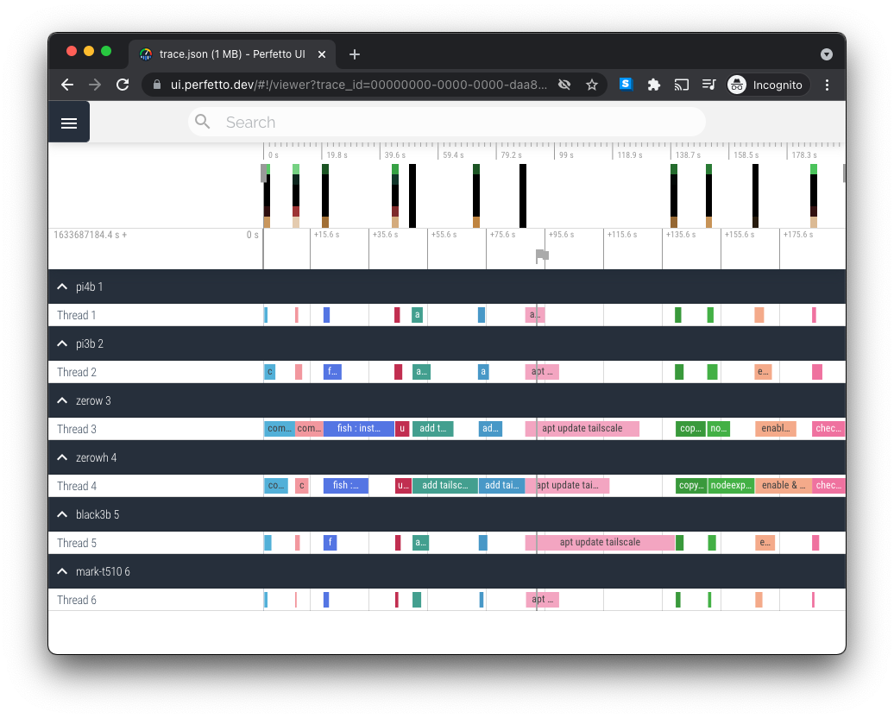
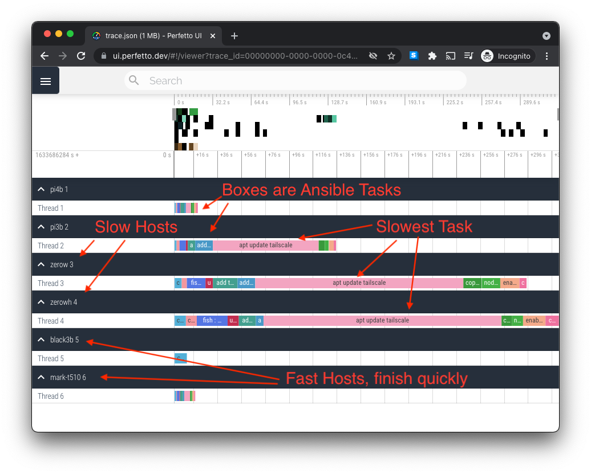
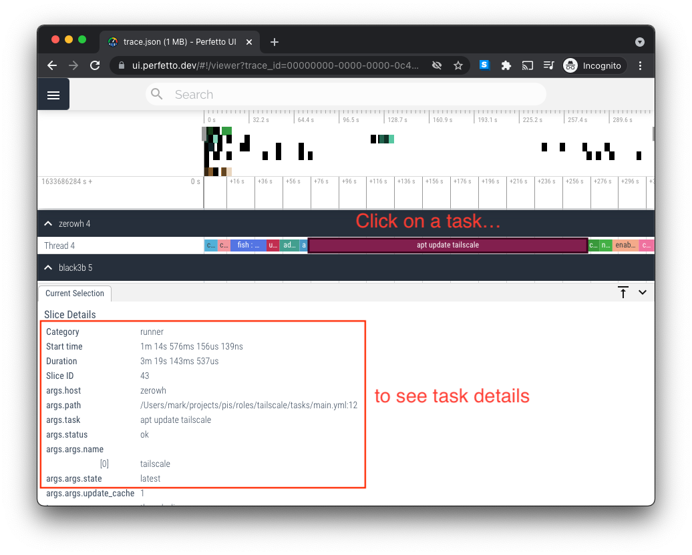

# ansible-trace

Visualise where time is spent in your Ansible playbooks: what tasks, and what hosts, so you can find where to optimise and decrease playbook latency.

An Ansible [Callback Function](https://docs.ansible.com/ansible/latest/plugins/callback.html) which traces the execution time of Ansible playooks, outputting [Chrome's Trace Event Format](https://docs.google.com/document/d/1CvAClvFfyA5R-PhYUmn5OOQtYMH4h6I0nSsKchNAySU/preview) for visualising in the [Perfetto](https://ui.perfetto.dev/) in-browser trace UI.

Here's a trace of me deploying to my home Raspberry Pi cluster, with the default [`strategy: linear`](https://docs.ansible.com/ansible/latest/collections/ansible/builtin/linear_strategy.html#linear-strategy). You can see that now all the tasks are synchronized across hosts, with each host waiting for the slowest host before proceeding to the next task:



Here's the same playbook ran with [`strategy: free`](https://docs.ansible.com/ansible/latest/collections/ansible/builtin/free_strategy.html) so fast hosts run to completion without waiting for slow hosts:



You can click on tasks to see details about them:



## Interactive Example

1.  Download (Right-click -> Save Link As) [example-trace.json](https://raw.githubusercontent.com/mhansen/ansible-trace/main/example-trace.json).
1.  Open https://ui.perfetto.dev/, and drag and drop in the downloaded example-trace.json.

## Usage

1.  Install with Ansible-Galaxy:

    ```shell
    ansible-galaxy collection install mhansen.ansible_trace
    ```

1.  Enable the `mhansen.ansible_trace.trace` callback plugin in your `ansible.cfg`:

    ```ini
    [defaults]
    callbacks_enabled = mhansen.ansible_trace.trace
    ```

    Or, enable it at the top of your playbook yml:

    ```yml
    ansible:
      env:
        CALLBACKS_ENABLED: mhansen.ansible_trace.trace
        TRACE_OUTPUT_DIR: ./trace
        TRACE_HIDE_TASK_ARGUMENTS: True
    ```

1.  Run your Ansible Playbook:

    ```shell
    $ ansible-playbook site.yml
    ```

    This will output `trace-<timestamp>.json` in the `TRACE_OUTPUT_DIR` (by default: `./trace/`).

1.  Open https://ui.perfetto.dev/, and drag-and-drop in the `trace-<timestamp>.json`.
    
    You don't have to wait for the trace to finish; you can open in-progress trace files.

## Other Trace Viewers

Perfetto is the most mature trace viewer, but here are some other options:

-  chrome://tracing (aka [Catapult Trace Viewer](https://chromium.googlesource.com/external/github.com/catapult-project/catapult/+/refs/heads/master/tracing/docs/getting-started.md)) is the older version of Perfetto. Supports generating a standalone HTML page.
-  [Speedscope](https://www.speedscope.app/) can open the traces, but only shows one host at a time.
-  [Firefox Profiler](https://profiler.firefox.com/) can open the traces, showing trace spans in the "Marker Chart" tab: [example](https://share.firefox.dev/3mGRPJc).

## Other Ansible Profiling Tools

### profile_tasks

[`ansible.posix.profile_tasks`](https://docs.ansible.com/ansible/latest/collections/ansible/posix/profile_tasks_callback.html) displays task timing as console output, but can't visualise gaps in the timing (e.g. with `strategy: linear` when fast hosts wait for slow hosts).

### ansible-playbook -vvvv

[Adding extra `v`s adds more debug info](https://docs.ansible.com/ansible/latest/cli/ansible-playbook.html#cmdoption-ansible-playbook-v), `-vvvv` enables connection debugging.

### Logging and Tracing Plusing in community.general

[`community.general`](https://docs.ansible.com/ansible/latest/collections/community/general/index.html#callback-plugins)
contains many callback plugins for logging task events to various outputs,
including Azure Log Analyics, LogDNA, Logentries, Logstash, Nagios,
OpenTelemetry, Splunk, Sumologic, and Syslog.

### Mitogen for Ansible

[Mitogen](https://mitogen.networkgenomics.com/ansible_detailed.html) promises to speed up your Ansible playbooks with a persistent interpreter. They profile their runs for bandwidth an time by analysing network packet captures.

You need to install from HEAD to support latest Ansible versions, because there hasn't been a tagged release since 2019.
